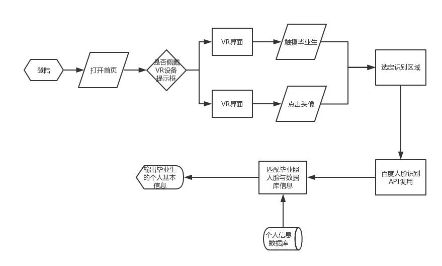
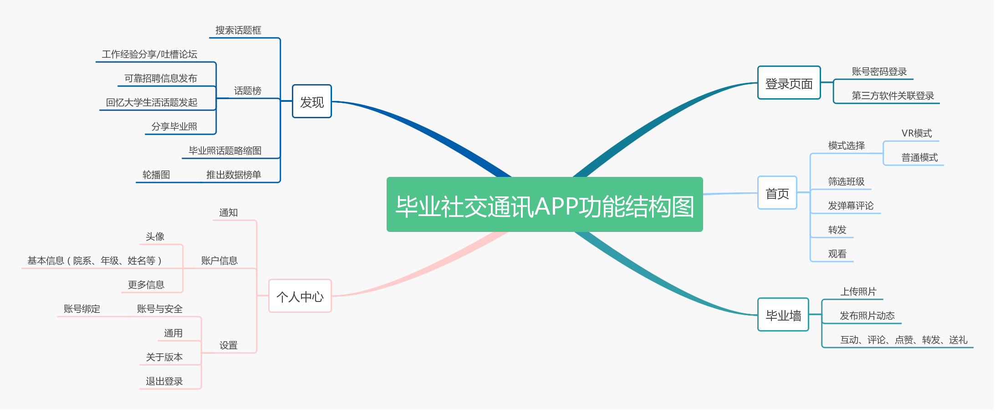
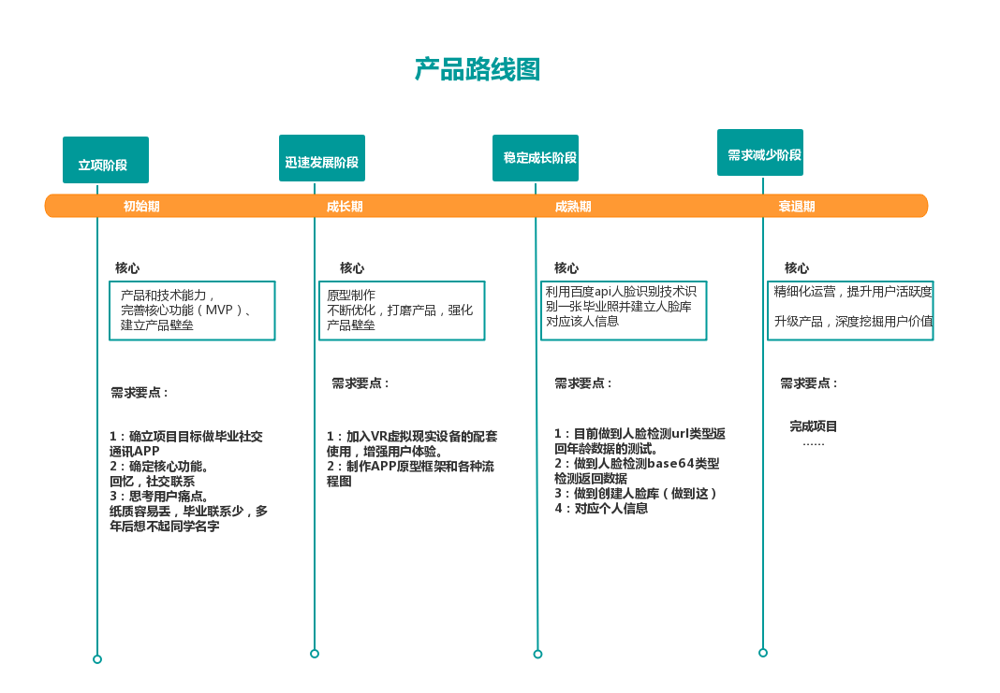
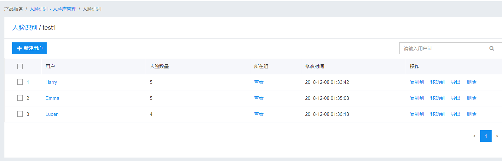

#  毕业通讯社交APP产品PRD

## 1.产品需求（Product Requirements）：
Target release | 2018年12月3日
---|---
owner | Sophialuu
designer | Sophialuu
Document Status|2.0
Developer| Sophialuu
QA| Sophialuu

## 2.目标（Goals）：

总目标：做一个毕业通讯社交APP，记录校园每一届毕业生的毕业照，然后利用人脸识别系统，每个人脸对应ta的个人信息（姓名，联系电话，QQ，微信，专业等），也可以方便毕业之后联系。APP两大特色：回忆与联系。
 

## 3.背景和策略（Background&strategic fit）：
弱关系更有助于我们获取信息。很多人会觉得应该和同行业的人以及同等价值观的人交流，最为没有阻碍，最有效率。所以我们拼命得维系着我们的强关系，不断交流不断碰撞却常常陷入死角；强关系提供了纽带，而弱关系则扮演了桥梁的角色。如果能够将强关系的信任和弱关系的新信息组合起来，你会发现自己很多时候都变得游刃有余。

1. 灵感来源于小时候填的同学回忆录，但是纸质的可能只会不 会经常打开，APP可以随时打开。
2. 建立并维系强大的社交网，在毕业后有需要还能联系。人们常说大学就是社会的缩影，这个APP可以方便日后有需要的话，可以利用大学的人力资源。
3. 结合虚拟现实技术，可以回忆大学的生活，看到从前的自己。
4. https://blog.csdn.net/qq_40821981/article/details/84670058 百度API人脸库应用

- 策略：
运用了机器学习中视觉技术的细粒度图像识别的图像分析——图像主体检测功能，通过即对于输入的一张毕业照图片（可正常解码，且长宽比适宜），识别里面人脸，返回人脸数据id匹配人脸库对应人脸信息，输出该人的个人信息。

## 4.需求（Requirements）：

title | User story |importance |notes |
--- |--- |--- |--- |
痛点1 | 毕业多年后后看到毕业照对应不上同学的名字|   importance |APP的总目标。APP可以点击毕业照头像对应上同学信息|
痛点2 | 填写纸质通讯录容易丢，不能实时更新信息|  general |APP可以随时随地打开查看。个人信息页面可以编辑信息，实时更新个人信息|
痛点3 | 毕业后有需要找老师、同学帮忙不知道找谁| general |APP可以加强联系，有记录信息数据的分析收集是个大工程|
痛点4 | 毕业后联系少| general |APP可以加强互动，毕业墙留言、送礼社交性加强，可是功能实现需要强大的技术支持|
痛点5 | APP没人支持，毕业生缺乏可靠招聘信息|general|  与可靠的招聘网站/企业合作，拉赞助|

## 5.假设（Assumptions）:
1.用户使用通讯录回忆册页面的时候可以佩戴相关的VR产品，让用户身临其境回忆起毕业照的场景。

## 6.用户交互和设计（user interaction and design）

Axure预览网址/图片
 https://lujiayan.github.io/API_yuanxing/
 
- 平静技术互动原则
1.  输入：点击/触摸毕业生头像
2.  输出：毕业生信息（姓名，性别，院系、班级）、VR模拟毕业照现场。

1. 产品功能图：

2. 业务流程图：

3.. API调用代码档
 https://github.com/LuJIAYan/API_ML_AI/blob/master/API_face%20recognition%20(1).ipynb
 
 
 
 - 目前只实现了输入一张图片（通过url或者本地），检测返回人脸的年龄、人种、性别等数据，检测图片人数。
 - 后期利用dlib或者是opencv模块调用api然后建个库做训练集，输入图片及对应信息。然鹅，那些环境部署安装还没成功...
 https://blog.csdn.net/ebzxw/article/details/80441556
 https://blog.csdn.net/u010151698/article/details/79265951
 
4.用在百度开发平台建立了人脸库，调用有参数错误。

## 7.问题（questions）：

 1. 角度、光线、发型、脸型相似等干扰分类。
 2. API要怎么做训练集？
 3. 怎么做到一张图片中点击头像选择选定区域，然后进行图像识别检测并匹配学生信息？
 4. 最小目标，实现毕业照人脸识别信息
 5. 人脸识别+VR环境部署？

## 8.不能做（not doing）：

 1. 有些人不想公开自己的毕业照
 2. 有些人不想公开隐私信息
 3. 担心聊天恶意骚扰，因此有临时会话框，可以不用加微信也能聊天。
 4. 单人特征识别中的性别识别。人脸识别仅能识别到人脸外貌更偏向女性还是男性，很难对女生男相、男生女相进行正确的判断。--不检测男女
