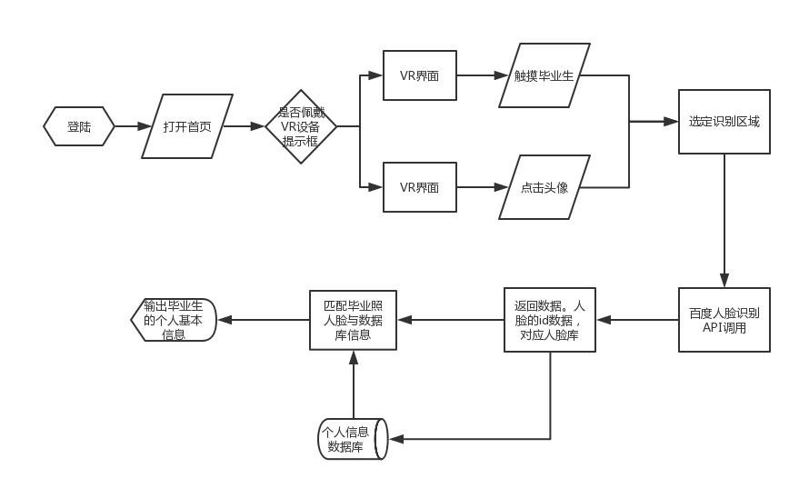

#  毕业通讯社交APP产品PRD  
## 1.Product Requirements：
Target release | 2018年12月3日
---|---
owner | Sophialuu
designer | Sophialuu
Document Status|3.0
Developer| Sophialuu
QA| Sophialuu

## 2.Introduction：
“毕业生”APP是一个提供给毕业生回忆与联系大学的毕业通讯社交APP。
## 加值部分：
通过调用百度人脸识别API，点击APP毕业照人脸头像，返回人脸姓名等相关信息，方便毕业生查找相关同学的信息，加强沟通协作。

## 核心价值：
最小可行性目标是实现一张毕业照（4个同学）识别，返回同学姓名，专业等相关信息。

## 3.Goals：
APP两大特色：回忆与联系。 
* 加强联系： 
做一个毕业通讯社交APP，记录校园每一届毕业生的毕业照，然后利用人脸识别系统，每个人脸对应ta的个人信息（姓名，联系电话，QQ，微信，专业等），也可以方便毕业之后联系，点击头像可以发起临时会话，加强联系。

* 社交化回忆，增加用户互动： 
1. APP还有毕业墙页，相当于毕业生的朋友圈，又区别于微信朋友圈，该APP可以送礼，留言会浮动在页面下方，视觉效果比较不一样； 
2. 再根据点赞的数据，做数据分析和数据可视化，每周推出数据榜单，如：我的头号粉丝（点赞评论次数最多的人筛选出来）等； 
3. (远）有能力的话结合虚拟现实技术，发展VR一体机，再现大学毕业场景，让用户声临其境，与过去自己对话（类似哈利波特、头号粉丝的情景），回忆过去，反思现在。 

## 4.Background&strategic fit：
1. 弱关系更有助于我们获取信息。很多人会觉得应该和同行业的人以及同等价值观的人交流，最为没有阻碍，最有效率。所以我们拼命得维系着我们的强关系，不断交流不断碰撞却常常陷入死角；强关系提供了纽带，而弱关系则扮演了桥梁的角色。如果能够将强关系的信任和弱关系的新信息组合起来，你会发现自己很多时候都变得游刃有余。
2. 再者，开放式创新组织间知识协同是组织间在知识方面的相互配合与协作，知识资源跨越组织边界的优化配置。该APP可以把不同专业的人汇聚在一起同时提供平台他们联系合作，各施所长，协同发展创新。

- 策略：
运用了机器学习中视觉技术的细粒度图像识别的图像分析——图像主体检测功能，通过即对于输入的一张毕业照图片（可正常解码，且长宽比适宜），识别里面人脸，返回人脸数据id匹配人脸库对应人脸信息，输出该人的个人信息。

## 5.Requirements：
* 用户痛点
1. 毕业后对应不上同学名字，忘记同学姓名
2. 毕业后想找其他专业同学合作，不知道姓名及联系方式
3. 毕业后同学联系互动少

* 需求列表

title | User story |importance |notes |技术
--- |--- |--- |--- |---
遗忘与回忆 | 毕业多年后后看到毕业照对应不上同学的名字等信息| importance |核心功能|百度人脸识别
加强联系合作 | 毕业后联系少互动少| general |APP的毕业墙留言、送礼、临时会话|通讯技术、直播送礼相关技术
趣味性 | 用户粘度不高| general |APP的定时推出最榜单|数据分析与利用

## 6.Assumptions:
1.用户使用通讯录回忆册页面的时候可以佩戴相关的VR产品，让用户身临其境回忆起毕业照的场景。

## 7.user interaction and design

Axure预览网址/图片
 https://lujiayan.github.io/API_yuanxing/
 
- 平静技术互动原则
1.  输入：点击/触摸毕业生头像
2.  输出：毕业生信息（姓名，性别，院系、班级）、VR模拟毕业照现场。

1. 产品功能图：

## 8.API输入与输出
* 人工智能概率性：由于照片人脸的角度、光线、发型问题，识别人脸会有出错几率。网络上说有99.7%，我尝试跑过一张4人毕业照，是可以成功检测出四张人脸的。

*  API调用代码档
 https://github.com/LuJIAYan/API_ML_AI/blob/master/API_face%20recognition%20(1).ipynb
 

 - 目前只实现了输入一张图片（通过url或者本地），检测返回人脸的年龄、人种、性别等数据，检测图片人数。
 
 
4.用在百度开发平台建立了人脸库，调用有参数错误。

## 9.（可解决问题）questions：
1. 调用api识别人脸
2. 返回人脸姓名等个人信息
3. 分享
4. 不公开隐私信息，有设置按钮，防止恶意骚扰

## 10.not doing：
 1. 虚拟现实情景
 2. 数据榜单
 
* 使用后风险报告:
单人特征识别中的性别识别。人脸识别仅能识别到人脸外貌更偏向女性还是男性，很难对女生男相、男生女相进行正确的判断。--已输出学生的姓名、专业为主。

* 使用分析对比
预调用百度人脸检测api、旷视face++、微软人脸检测做对比，有待完善..
